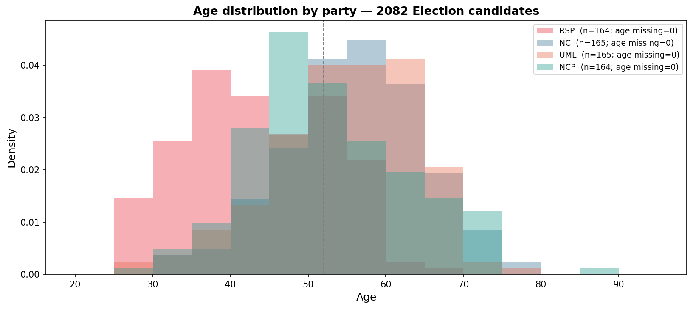
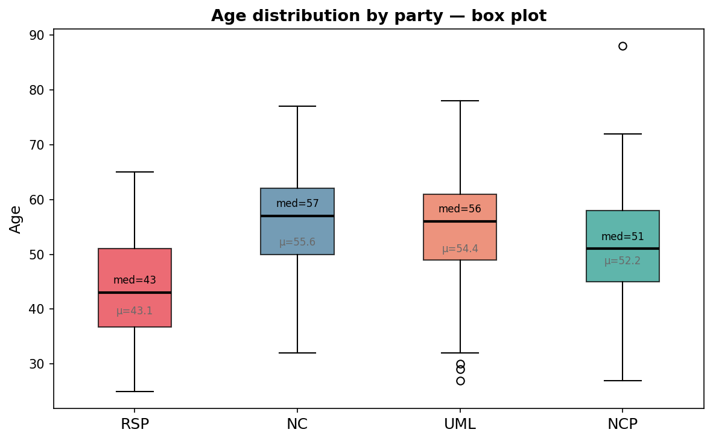
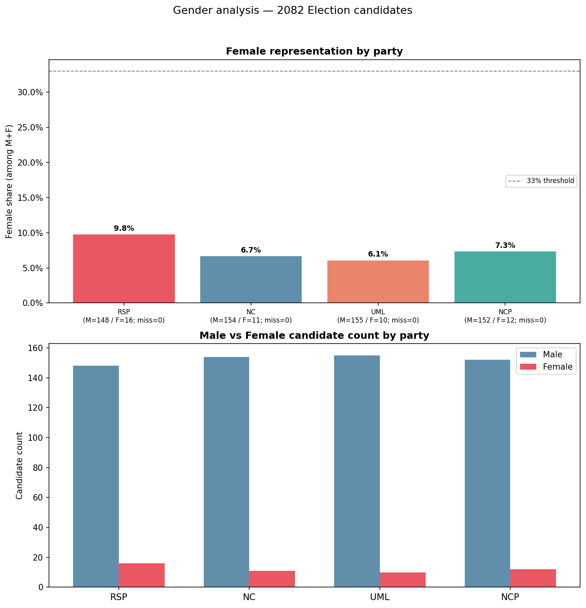
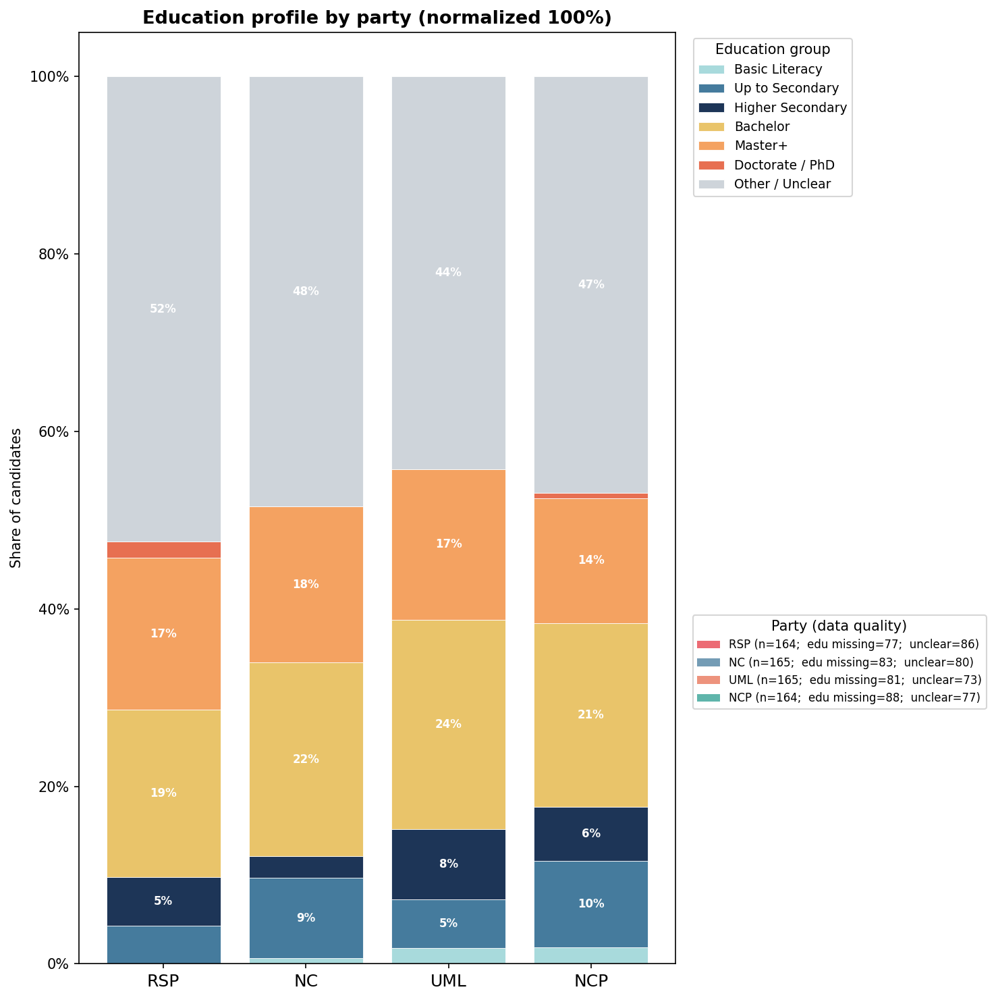
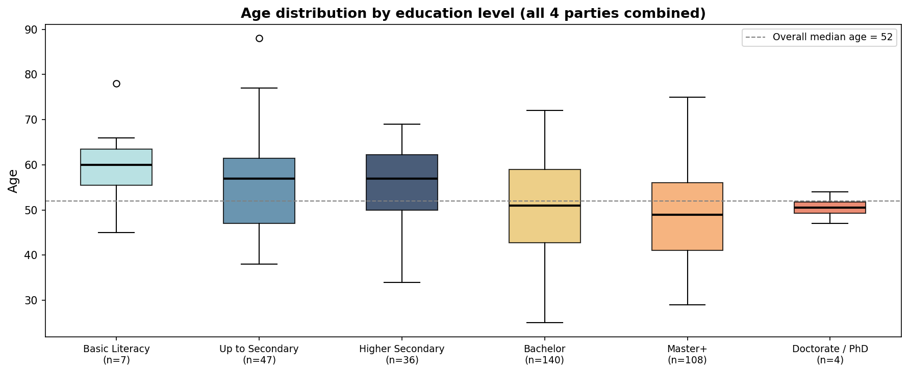
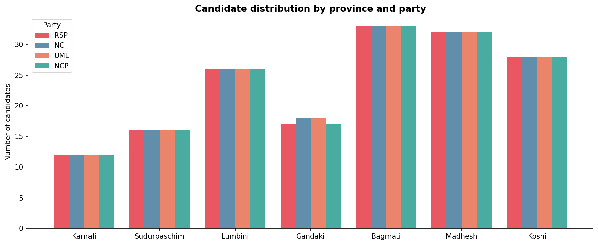
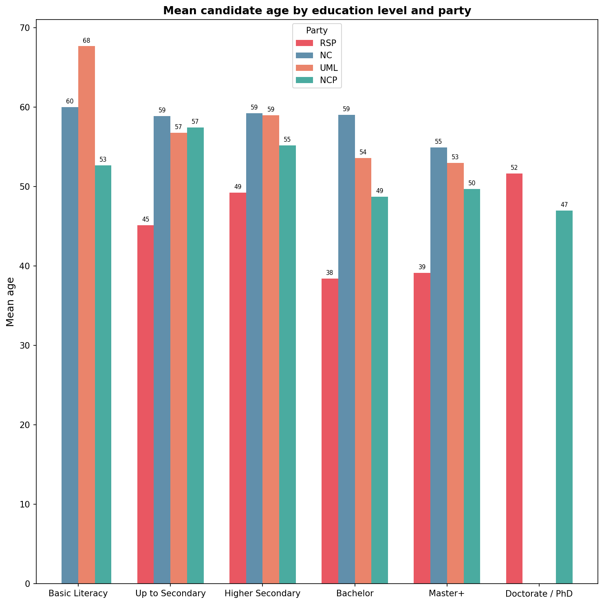

# Nepal Election 2082 — Candidate Demographics Dataset

A data-collection and analysis project that scrapes, cleans, and analyses the demographic profiles of all **3,487 candidates** who will contest in Nepal's 2082 B.S. (2026 A.D.) federal and provincial elections. The dataset covers age, gender, education level, party affiliation, and geographic distribution, with a focused comparative analysis across the four major parties: **RSP, NC, UML, and NCP**.

---

## Table of Contents

- [Background](#background)
- [Data Sources](#data-sources)
- [Project Structure](#project-structure)
- [Methodology](#methodology)
- [Dataset Schema](#dataset-schema)
- [Key Findings](#key-findings)
- [Visualisations](#visualisations)
- [Reproducing the Pipeline](#reproducing-the-pipeline)
- [Limitations](#limitations)

---

## Background

Nepal's 2082 B.S. elections were a significant democratic exercise covering 165 federal constituencies across 7 provinces. This project was motivated by a lack of easily accessible, structured data on who the candidates actually are — their ages, educational qualifications, and how these vary across parties and geography. The pipeline scrapes two complementary public sources, reconciles them, and produces a clean, analysis-ready dataset.

---

## Data Sources

| Source | URL | Used For |
|--------|-----|----------|
| **HamroPatro Election Portal** | `election.hamropatro.com/2082` | Primary source — name, party, age, gender, constituency, education, institution, DOB, citizenship district, address |
| **2082.live** | `2082.live/candidates` | Fallback education values for candidates where HamroPatro had no qualification field |

Candidate IDs on HamroPatro are sequential integers in the range 339,000–343,500. A parallel range scan (12 threads) was used to identify all 3,487 valid profiles within that window.

---

## Project Structure

```
Election_2082/
│
├── data_collection.ipynb          # Scraping pipeline (ID discovery → profiles → export)
├── data_analysis.ipynb            # Analysis & visualisation notebook
│
├── assets/
│   ├── index_candidates.jsonl     # Raw candidate ID index from range scan
│   ├── profiles_hamropatro.jsonl  # Raw scraped profiles (one JSON object per line)
│   ├── nepal_election_2082_candidates_education.csv   # Full merged dataset
│   ├── nepal_election_2082_candidates_education.parquet
│   ├── candidates_clean.csv       # QA-passed rows only
│   ├── candidates_audit.csv       # Rows with scrape errors (for review)
│   ├── run_metadata.json          # SHA-256 checksums + row counts for reproducibility
│   └── http_cache.sqlite          # Optional HTTP response cache (speeds up re-runs)
│
└── images/
    ├── plot_age_histogram.png
    ├── plot_age_boxplot.png
    ├── plot_gender.png
    ├── plot_education_stacked.png
    ├── plot_age_by_education.png
    ├── plot_gender_by_education.png
    ├── plot_province.png
    └── plot_mean_age_by_edu_party.png
```

---

## Methodology

### 1. ID Discovery — HamroPatro Range Scan
HamroPatro assigns sequential integer IDs to candidate profiles. A threaded range scan (12 workers) probes every integer in the window 339,000–343,500, checks whether each URL returns a page with a valid `<h1>` heading, and collects all 3,487 matching IDs. Results are checkpointed to `index_candidates.jsonl` so the scan can be skipped on re-runs.

### 2. Profile Scraping
Each candidate page is fetched with a polite delay (0.15–0.45 s jitter) using 6 concurrent threads. The HTML is parsed with BeautifulSoup and a label-walk strategy extracts structured fields such as name, party, age, gender, qualification, and institution. All raw records are appended to `profiles_hamropatro.jsonl` for incremental resumability.

### 3. Education Fallback
Approximately 19% of candidates (663) had no qualification field on HamroPatro. For these, the pipeline fetches the corresponding 2082.live profile and applies three extraction strategies (definition list, table row, label node walk-forward). This recovered education data for an additional 20 candidates.

### 4. Education Bucketing
Raw qualification strings in Nepali and English are normalised into nine ordered buckets:

| Bucket | Examples |
|--------|----------|
| Doctorate / PhD | PhD, पीएचडी, डाक्टरेट |
| MPhil | M.Phil, एम.फिल |
| Master+ | Masters, MA/MSc/MBA/MBS, स्नातकोत्तर |
| Bachelor | BA/BSc/BBA/BBS/LLB, स्नातक |
| Professional Degree | MBBS, CA, ACCA |
| Higher Secondary | +2, 10+2, PCL, Diploma, प्रविणता प्रमाणपत्र |
| Secondary | SLC, SEE, Grade 10, माध्यमिक |
| Lower Secondary / Primary | Grade 1–8, आधारभूत, कक्षा N |
| Basic Literacy | साक्षर, साधारण |

Strings that match none of these rules — and entries with missing data — fall into **Other / Unclear**.

### 5. QA & Export
Hard assertions verify: unique candidate IDs, absence of errors in the clean set, valid gender values, and presence of all 165 constituencies. Outputs are written to CSV and Parquet with SHA-256 checksums recorded in `run_metadata.json`.

---

## Dataset Schema

| Column | Description |
|--------|-------------|
| `candidate_id` | Unique integer ID from HamroPatro |
| `name_np` | Candidate name in Nepali |
| `party_np` | Party name in Nepali |
| `age` | Age in years |
| `gender` | पुरुष / महिला / अन्य |
| `province_np` | Province name in Nepali |
| `district_np` | District name in Nepali |
| `education_raw` | Cleaned raw qualification string |
| `education_bucket` | Normalised education tier |
| `institution_raw` | Raw institution name |
| `institution_norm` | Normalised institution (TU, KU, PU expanded) |
| `dob_bs_raw` | Date of birth in Bikram Sambat (raw string) |
| `constituency_no_hamro` | Constituency number within district |
| `election_year_bs` | Election year (2082) |
| `url_hamropatro` | Source profile URL |
| `url_2082live` | 2082.live profile URL |
| `scraped_at_utc_hamro` | Timestamp of HamroPatro scrape |
| `dataset_built_at_utc` | Timestamp of final dataset build |

---

## Key Findings

- **3,487 candidates** competed across 165 federal constituencies in all 7 provinces.
- **RSP fields the youngest candidates** by a wide margin — median age 43 vs. 57 (NC), 56 (UML), and 51 (NCP).
- **Female representation is critically low** across all four major parties, ranging from 6.1% (UML) to 9.8% (RSP) — far below the 33% constitutional threshold.
- **UML leads on declared higher education** (41% Bachelor+), followed closely by NC (39%) and RSP (38%), with NCP at 35% — though 44–52% of each party's candidates have missing or unclassified education data.
- **RSP's educated candidates are markedly younger**: RSP candidates with a Bachelor's degree have a mean age of 38 vs. 59 for NC, suggesting RSP draws from a different generational cohort of educated professionals.
- **Province distribution is essentially uniform** across parties, reflecting the constitutional requirement to field a candidate in every constituency.

---

## Visualisations

### 1. Age Distribution — Density Histogram



Overlaid density histograms for all four parties show a striking generational divide. **RSP (red)** has a distribution that peaks sharply in the 35–45 age band, with a pronounced left-skew indicating a much younger candidate pool. The three established parties — **NC (blue), UML (orange), and NCP (teal)** — all peak between 50 and 60, with NC and UML showing broader, flatter distributions extending into the 70s. The dashed vertical line marks the overall median age of 52. The near-zero overlap between RSP's peak and those of the other three parties underscores how distinctly different RSP's candidate selection strategy is in terms of age.

---

### 2. Age Distribution — Box Plot



Box plots provide a clearer picture of spread and central tendency. **RSP** stands apart with a median of 43 and mean of 43.1, a compact interquartile range (roughly 37–51), and no extreme outliers. **NC** (median 57, mean 55.6) and **UML** (median 56, mean 54.4) have similar, older profiles with wide IQRs extending from the mid-40s to mid-60s. **NCP** sits between RSP and the two traditional left parties at median 51, mean 52.2, with a notable outlier at 88 — the eldest candidate in the dataset. UML shows two low-end outliers around age 27–30, suggesting a small number of unusually young candidates. RSP's entire box sits entirely below the median of every other party.

---

### 3. Gender Representation



The left panel shows female share (as a percentage of male + female candidates) for each party. The dashed line marks the **33% constitutional representation threshold**. All four parties fall drastically short: **RSP leads at 9.8%** (16 female out of 164), followed by **NCP at 7.3%** (12/164), **NC at 6.7%** (11/165), and **UML at 6.1%** (10/165). The right panel's raw counts make the disparity visually stark — female candidate bars are barely visible against the towering male counts (~148–155 per party). This pattern is consistent across all parties and reflects a systemic deficit in female candidate nomination at the first-past-the-post constituency level.

---

### 4. Education Profile — 100% Stacked Bars



This normalised stacked bar chart shows the education composition of each party's candidate field. The large **grey "Other / Unclear" segment** (44–52%) dominates every party, driven primarily by missing qualification data rather than truly unclassifiable responses. Among candidates with known education: **UML has the highest Bachelor share (24%)**, followed by NC (22%), NCP (21%), and RSP (19%). For Master+ (including MPhil), **NC leads at 18%**, with UML and RSP both at 17%, and NCP at 14%. Doctorate / PhD holders are a thin sliver across all parties. The second legend (bottom right) shows the exact missing data counts per party — NCP has the most missing education records (88 candidates), while UML has the fewest (81).

---

### 5. Age by Education Level



Box plots of age grouped by education level (all four parties combined) reveal a clear inverse relationship between education and age — with an important nuance. **Basic Literacy candidates are the oldest** (median ~60, n=7), consistent with older generations having had less access to formal schooling. **Up to Secondary** (n=47) and **Higher Secondary** (n=36) candidates also cluster above the overall median of 52 (dashed line). Moving to **Bachelor** (n=140), the median drops to ~51 with a much wider age spread (ages 26–73), reflecting how common Bachelor's degrees have become across generations. **Master+** (n=108) candidates have a median near 49, and **Doctorate / PhD** (n=4) sit tightly around 51 with very little spread. The pattern suggests that higher education is increasingly common among younger candidates entering politics, while older politicians were elected before tertiary education was widespread.

---

### 6. Female Share by Education Group — Per Party


Each panel shows the female share within each education group for one party. The dashed 33% line is never crossed in any party or education tier, confirming the gender deficit is not concentrated in any particular education band. For **RSP**, female representation peaks in the Higher Secondary tier (~22%), suggesting that RSP's female candidates skew slightly less educated than its male candidates. **NC** shows an unusual pattern: female share is relatively higher among Master+ candidates (~17%) than among Bachelor candidates (~3%), hinting that NC may nominate educated women as token candidates in select constituencies. **UML** and **NCP** show broadly similar, uniformly low female shares (under 15% in every tier). Many education groups have zero female candidates, particularly Basic Literacy and Doctorate / PhD tiers across most parties.

---

### 7. Candidate Distribution by Province



A grouped bar chart ordered geographically west to east shows how many candidates each party fields in each of Nepal's seven provinces. The bars are nearly identical for all four parties within every province — a direct consequence of the constitutional requirement that major parties field a candidate in every constituency. **Bagmati Province has the most candidates** (~33 per party), reflecting its large number of constituencies, followed by **Madhesh (~32)** and **Koshi (~28)**. **Karnali Province**, Nepal's most remote and sparsely populated, has the fewest constituencies and consequently the fewest candidates (~12 per party). The uniformity across parties within each province confirms that party geography is determined by constituency boundaries, not selective deployment.

---

### 8. Mean Candidate Age by Education Level and Party



This grouped bar chart is one of the most revealing in the analysis. While the general trend of lower age with higher education holds across all parties, the **RSP effect is dramatic and consistent across every education tier**. RSP (red) candidates are substantially younger than their counterparts in NC, UML, and NCP at every level:

- **Bachelor tier**: RSP mean age = **38** vs. NC = 59, UML = 54, NCP = 49
- **Master+ tier**: RSP mean age = **39** vs. NC = 55, UML = 53, NCP = 50
- **Higher Secondary**: RSP = 49, NC = 59, UML = 59, NCP = 55

This is not simply because RSP has more young candidates overall — it specifically selects younger, educated candidates. NC's Bachelor and Master+ candidates averaging 59 and 55 respectively suggests those positions are occupied by career politicians who obtained their degrees decades ago. RSP's pattern is consistent with a deliberate strategy to field a new generation of educated professionals, which aligns with its founding narrative as a reform-oriented party.

---

## Reproducing the Pipeline

### Requirements

```bash
pip install requests beautifulsoup4 lxml pandas tqdm requests-cache pyarrow jupyter
```

### Steps

1. **Clone the repository** and open `data_collection.ipynb` in Jupyter.
2. **Run all cells** in `data_collection.ipynb`. The range scan will take approximately 5–10 minutes on a stable internet connection. Subsequent runs use the HTTP cache and JSONL checkpoints and complete in seconds.
3. Open `data_analysis.ipynb` and **run all cells** to reproduce all eight plots. Plots are saved to `images/`.

### Configuration

Key parameters in `data_collection.ipynb` (Cell 2):

| Parameter | Default | Description |
|-----------|---------|-------------|
| `HAMRO_ID_RANGE_START` | 339,000 | Lower bound of ID range scan |
| `HAMRO_ID_RANGE_END` | 343,500 | Upper bound of ID range scan |
| `RANGE_SCAN_WORKERS` | 12 | Threads for range scan |
| `MAX_WORKERS` | 6 | Threads for profile scraping |
| `REQUEST_DELAY_RANGE` | (0.15, 0.45) s | Jitter between requests |
| `USE_HTTP_CACHE` | True | Cache HTTP responses to SQLite |

---

## Limitations

- **Missing education data (~46% of all candidates)**: HamroPatro does not require candidates to declare qualifications; the pipeline cannot infer what is not published. Figures on education distribution should be treated as lower-bound estimates for declared qualifications.
- **Nepali-script variation**: The same qualification can appear in many different spellings and abbreviations. The bucketing regex covers the most common variants but some edge cases remain in "Other / Unclear".
- **Snapshot data**: Profiles were scraped in February 2026. Any updates made to the source websites after that date are not reflected in this dataset.
- **Four-party focus**: The analysis notebook focuses on the four major parties (RSP, NC, UML, NCP) which together account for ~658 candidates out of 3,487 total. Analysis of smaller parties and independent candidates would require extending the analysis notebook.
- **Age data**: Ages are sourced from HamroPatro's display field and assumed to be as of the election date; no independent verification was performed.
